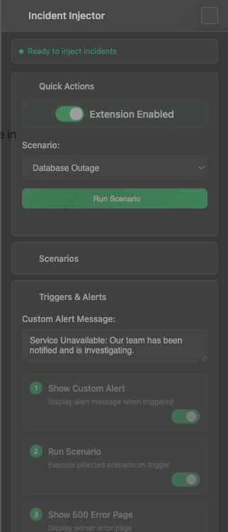

# Incident Injector

A Chrome extension for incident response testing and resilience training.

> **⚠️ Security First**: Extension starts completely disabled by default. You must manually enable and configure all features before use.

## Overview

The extension simulates realistic failure scenarios by intercepting user interactions and creating corresponding PagerDuty incidents, enabling teams to practice their response workflows in a controlled environment.

## Screenshots

### Extension Panel Interface

*Modern slide-out panel with Space Grotesk typography*

### Configuration Options

*Comprehensive settings for incident simulation*

## Quick Start

### Installation

1. **Download the latest release**
   - Navigate to the [Releases](releases) page
   - Download `incident-injector-v1.4.zip`
   - Extract the ZIP file to a local directory

2. **Install in Chrome**
   - Open Chrome and navigate to `chrome://extensions/`
   - Enable "Developer mode" using the toggle in the top right corner
   - Click "Load unpacked" and select the extracted folder
   - The extension icon should appear in your browser toolbar

3. **Configure PagerDuty Integration**
   - Obtain an Events API v2 integration key from your PagerDuty service
   - Click the extension icon to open the configuration panel
   - Enter your integration key and configure simulation settings

### Development Installation

For developers or contributors:

1. **Clone the repository**
   ```bash
   git clone https://github.com/justynroberts/Browser-incident-injector.git
   cd Browser-incident-injector
   ```

2. **Install in Chrome**
   - Open Chrome and navigate to `chrome://extensions/`
   - Enable "Developer mode"
   - Click "Load unpacked" and select the `extension` folder
   - The extension will be installed in development mode

## Getting Started

### First Time Setup
**⚠️ Important**: This extension starts completely disabled for security. Follow these steps:

1. **Install the extension** following the installation steps above
2. **Click the extension icon** in your browser toolbar to open the configuration panel
3. **Enable the extension** by toggling the "Extension Enabled" switch
4. **Configure PagerDuty** by entering your integration key
5. **Optional**: Enable "Trigger on Click" and specify which button text should trigger incidents

### Default Security Behavior
- Extension is **disabled** on first install
- Click interception is **disabled** by default
- No hardcoded targets (no automatic "login" or "submit" button interception)
- You must explicitly configure which text triggers incidents
- All settings persist across browser restarts via localStorage

## Features

### Core Functionality
- **Slide-out Panel Interface**: Modern, non-intrusive panel that slides in from the right side
- **Automated Incident Creation**: Generates PagerDuty incidents based on user interactions
- **Realistic Error Simulation**: Displays professional error pages mimicking production failures
- **Click Interception**: Monitors and responds to specific user interface elements
- **Scenario-Based Testing**: Supports complex, multi-step incident response scenarios

### Advanced Capabilities
- **Persistent Settings**: All configurations and custom scenarios are preserved across tabs and browser sessions
- **Auto-collapsing Sections**: Clean, organized interface with collapsible configuration sections
- **Template Variables**: Dynamic incident details using configurable variables
- **Batch Event Processing**: Efficient handling of multiple incident events
- **CSP-Safe Icons**: Unicode fallback icons ensure compatibility across all websites
- **Visual Indicators**: Clear UI feedback during active simulations with progress tracking

## Usage

### Basic Incident Simulation
1. **Enable the extension** - Click the extension icon and toggle "Extension Enabled"
2. **Configure PagerDuty** - Enter your integration key in the configuration panel
3. **Set up click targets** (optional) - Enable "Trigger on Click" and specify target button text
4. Navigate to any website with form elements or your configured targets
5. Interact with forms or target elements to trigger incidents
6. Monitor PagerDuty for generated incidents

### Scenario Testing
1. **Ensure extension is enabled** first
2. Load a scenario definition file via the extension panel
3. Select the desired scenario from the dropdown menu
4. Click "Test Current Scenario" to execute
5. Monitor scenario progress through visual indicators

## Configuration

### PagerDuty Setup
1. Obtain an Events API v2 integration key from your PagerDuty service
2. In the extension popup, navigate to "PagerDuty Configuration"
3. Enter your integration key and save

### Simulation Settings
- **Custom Alert Messages**: Configure error messages displayed during simulated failures
- **500 Error Pages**: Enable realistic server error page redirects with incident tracking
- **Click Interception**: Configure specific button text that triggers incident simulations (disabled by default)
- **Scenario Testing**: Load and execute complex multi-step incident scenarios

## Event Definitions

The extension supports JSON-formatted event definition files containing:
- Multiple incident scenarios
- Configurable delay patterns
- Custom incident details and metadata
- Template variable substitution

Example event definition structure:
```json
{
  "schema_version": "1.0",
  "global_config": {
    "variables": {
      "environment": "production",
      "region": "us-east-1"
    }
  },
  "event_definitions": [
    {
      "id": "database_outage",
      "name": "Database Outage Scenario",
      "description": "Simulates a database failure with cascading effects",
      "events": [
        {
          "type": "trigger",
          "summary": "Database connection timeout",
          "severity": "critical",
          "delay": {
            "type": "fixed",
            "value": 10000
          }
        }
      ]
    }
  ]
}
```

## Security Considerations

### Intended Use
This extension is designed exclusively for **defensive security purposes**:
- Incident response training and preparation
- System resilience testing
- Team readiness assessment
- Workflow validation exercises

### Restrictions
- **Authorized Testing Only**: Use only on systems you own or have explicit permission to test
- **No Malicious Intent**: This tool must not be used for unauthorized testing or malicious purposes
- **Data Protection**: Ensure compliance with organizational data protection policies

## Technical Specifications
- **Platform**: Google Chrome (Manifest v3)
- **Dependencies**: None (standalone extension)
- **API Integration**: PagerDuty Events API v2
- **File Size**: ~50KB (compressed distribution)
- **Permissions**: Storage, Active Tab, Notifications

## Documentation

- **[Developer Guide](docs/DEVELOPER.md)**: Advanced configuration and event definition development
- **[Sample Event Definitions](docs/sample-event-definition.json)**: Example scenarios for reference

## Support

For technical support, bug reports, or feature requests:
1. Check the [GitHub Issues](../../issues) page for existing discussions
2. Create a new issue with detailed information about your concern
3. Contact your security team for organization-specific support

## Version History

### Version 1.4 (October 2025)
- **Typography Update**: Replaced Grandstander with modern Space Grotesk font
- **Font Bundling**: All fonts bundled in extension (no external CDN requests)
- **CSP Compliance**: Fonts load without CSP violations using extension URLs
- **Error Handling**: Added robust error handling for extension context invalidation
- **Performance**: WOFF2 format provides optimal compression and browser support

### Version 1.3 (September 2025)
- **Security Improvements**: Extension now starts completely disabled by default
- **User-Controlled Targeting**: Removed hardcoded click targets ("login", "submit", etc.)
- **Enhanced Persistence**: Added localStorage backup for settings across browser restarts
- **Configurable Click Interception**: Click interception only works with user-specified text
- **Safer Defaults**: No automatic form or button interception without explicit user configuration

### Version 1.2 (January 2025)
- **Major UI Overhaul**: Converted from popup to slide-out panel for better usability
- **Enhanced Persistence**: Complete state preservation across tabs and browser sessions
- **CSP Compliance**: Removed Font Awesome dependency, using Unicode fallback icons
- **Improved UX**: Consolidated save buttons, auto-collapsing sections, minimized default view
- **Better Error Handling**: Robust Chrome API fallbacks with message relay system
- **Auto-save Features**: Event definitions and scenario selections save automatically
- **Visual Refinements**: Clean, modern interface with improved spacing and organization

### Version 1.1 (August 2025)
- Resolved click interception race condition
- Enhanced scenario execution indicators
- Improved error page authenticity
- Comprehensive error handling implementation
- Automatic target element configuration
- Extended debugging capabilities

### Version 1.0 (December 2024)
- Initial release with core functionality
- Basic PagerDuty integration
- Simple click interception
- Foundation scenario system

---

**Incident Injector v1.4** | [Download Latest Release](releases) | [Report Issues](../../issues)
