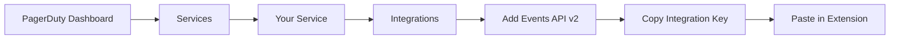

<div align="center">

# 🚨 Incident Injector
### *PagerDuty Form Simulator Chrome Extension*

[](https://chrome.google.com/webstore)
[](https://choosealicense.com/licenses/mit/)
[](https://developer.pagerduty.com/api-reference/)

*Simulate realistic incident scenarios and test your team's response procedures with ease*

[🚀 Quick Start](#-quick-start) • [📖 Documentation](#-documentation) • [🎯 Features](#-features) • [🛠️ Installation](#️-installation)

</div>

---

## 🎯 Features

<table>
<tr>
<td width="50%">

### 🎪 **Incident Simulation**
- 🔄 Intercept form submissions on any website
- 🖱️ Target specific clickable elements
- 📡 Send incidents via PagerDuty Events API v2
- 🚨 Customizable error alerts
- 🔀 Optional 500 error page redirects

</td>
<td width="50%">

### 🎮 **Interactive Controls**
- 🎈 **Floating toggle button** for quick access
- 👁️ Visual extension status indicators
- ⚙️ Configurable visibility settings
- 🎛️ Real-time configuration updates

</td>
</tr>
<tr>
<td width="50%">

### 📋 **Event Definition System**
- 📝 JSON-based scenario definitions
- 🎭 Multiple event types support
- ⏱️ Sophisticated timing controls
- 🧪 Dry-run testing capability

</td>
<td width="50%">

### 🔧 **Advanced Features**
- 🔄 Variable template substitution
- 💾 Save/load scenario definitions
- 🎯 Automatic scenario execution
- 🌐 Cross-browser compatibility

</td>
</tr>
</table>

---

## 🚀 Quick Start

### 1️⃣ Install the Extension

<details>
<summary><b>🔧 Developer Mode (Recommended)</b></summary>

```bash
# Clone the repository
git clone https://github.com/your-repo/incident-injector.git
cd incident-injector
```

1. Open Chrome → `chrome://extensions/`
2. Enable **"Developer mode"** (top right toggle)
3. Click **"Load unpacked"**
4. Select the `pagerduty-form-simulator` folder
5. ✅ Extension icon appears in toolbar

</details>

<details>
<summary><b>🏪 Chrome Web Store (Coming Soon)</b></summary>

1. Visit the [Chrome Web Store](https://chrome.google.com/webstore)
2. Search for **"Incident Injector"**
3. Click **"Add to Chrome"**
4. Confirm installation

</details>

### 2️⃣ Configure PagerDuty


```mermaid
graph LR
    A[PagerDuty Dashboard] --> B[Services]
    B --> C[Your Service]
    C --> D[Integrations]
    D --> E[Add Events API v2]
    E --> F[Copy Integration Key]
    F --> G[Paste in Extension]
```

1. 🔑 Get your **Integration Key** from PagerDuty
2. 🎯 Click the extension icon in Chrome
3. 📋 Paste the key in the **"Integration Key"** field
4. ✅ Enable the extension toggle

### 3️⃣ Start Testing

🎉 **You're ready!** Submit any form or click targeted elements to trigger incidents.

---

## 🛠️ Installation

<div align="center">

### 📋 Prerequisites

| Requirement | Version | Status |
|-------------|---------|--------|
| Chrome | 100+ | ✅ Supported |
| Edge | 100+ | ✅ Supported |
| Brave | 1.40+ | ✅ Supported |
| PagerDuty Account | Any | ✅ Required |

</div>

---

## ⚙️ Configuration Options

<table>
<tr>
<th width="30%">Setting</th>
<th width="50%">Description</th>
<th width="20%">Default</th>
</tr>
<tr>
<td><code>🔘 Extension Enabled</code></td>
<td>Master toggle for all functionality</td>
<td><code>false</code></td>
</tr>
<tr>
<td><code>💬 Custom Alert Message</code></td>
<td>Error message shown to users</td>
<td><code>"System Error"</code></td>
</tr>
<tr>
<td><code>🎭 Run Scenario</code></td>
<td>Auto-run selected scenario on form submit</td>
<td><code>false</code></td>
</tr>
<tr>
<td><code>🚫 Add 500 Error</code></td>
<td>Redirect to simulated error page</td>
<td><code>false</code></td>
</tr>
<tr>
<td><code>➡️ Continue to Destination</code></td>
<td>Allow normal form submission</td>
<td><code>true</code></td>
</tr>
<tr>
<td><code>🎯 Element Text to Hook</code></td>
<td>Comma-separated clickable text targets</td>
<td><code>""</code></td>
</tr>
<tr>
<td><code>🎈 Show Toggle Button</code></td>
<td>Display floating button on pages</td>
<td><code>true</code></td>
</tr>
</table>

---

## 📖 Documentation

### 🎭 Event Definition System

Create complex, multi-step incident scenarios with realistic timing:

```json
{
  "scenarios": {
    "database_outage": {
      "name": "🗄️ Database Outage Cascade",
      "description": "Simulates database failure with cascading effects",
      "events": [
        {
          "type": "trigger",
          "summary": "🔴 Database connection timeout",
          "severity": "critical",
          "component": "PostgreSQL Primary",
          "delay": { "type": "fixed", "value": 10000 }
        },
        {
          "type": "trigger", 
          "summary": "⚠️ API latency increased 500%",
          "severity": "error",
          "component": "API Gateway",
          "delay": { "type": "random", "min": 5000, "max": 15000 }
        }
      ]
    }
  }
}
```

### 🔄 Variable Substitution

| Variable | Description | Example |
|----------|-------------|---------|
| `{{timestamp}}` | Current ISO timestamp | `2024-01-15T10:30:00Z` |
| `{{random_number}}` | Random number | `42857` |
| `{{incident_id}}` | Generated incident ID | `INC-2024-001` |

### 📊 Event Types

<div align="center">

| Type | Icon | Purpose | Severity Options |
|------|------|---------|------------------|
| `trigger` | 🚨 | Create new incidents | `critical`, `error`, `warning`, `info` |
| `resolve` | ✅ | Close incidents | N/A |
| `acknowledge` | 👀 | Team acknowledgment | N/A |
| `change` | 🔄 | Document modifications | N/A |

</div>

---

## 🎮 Usage Examples

### 🎯 Form Interception
```javascript
// Any form submission triggers:
// 1. PagerDuty incident creation
// 2. Custom alert display  
// 3. Optional 500 error redirect
// 4. Automatic scenario execution (if enabled)
```

### 🖱️ Element Targeting
```javascript
// Configure target text: "submit,login,checkout"
// Clicking elements with this text triggers incidents
```

### 🎈 Toggle Button
- 🟢 **Green**: Extension enabled
- ⚪ **Gray**: Extension disabled
- 🖱️ **Click**: Open extension popup

---

## 🔧 Troubleshooting

<details>
<summary><b>🚨 No incidents created</b></summary>

- ✅ Verify integration key format (32 alphanumeric characters)
- 🔍 Check PagerDuty service configuration
- 🌐 Ensure network connectivity

</details>

<details>
<summary><b>🚫 Alerts not showing</b></summary>

- 🛡️ Some sites block alerts with CSP
- 🔄 Extension creates fallback alert div
- 🔍 Check browser console for errors

</details>

<details>
<summary><b>🎈 Toggle button missing</b></summary>

- ✅ Verify "Show Toggle Button" is enabled
- 🔄 Try refreshing the page
- 🛡️ Some sites block content scripts

</details>

<details>
<summary><b>🎭 Scenarios not triggering</b></summary>

- ✅ Ensure scenario is selected from dropdown
- 🔘 Verify extension is enabled
- 🔍 Check event-processor.js for errors

</details>

---

## 🚀 Advanced Usage

### 💾 Scenario Management

```bash
# Save scenarios to file
Click "Save to File" → Downloads JSON definition

# Load scenarios from file  
Click "Load from File" → Import JSON definition
```

### 🧪 Testing Modes

| Mode | Purpose | PagerDuty Impact |
|------|---------|------------------|
| **Live** | Production testing | ✅ Creates real incidents |
| **Dry Run** | Safe testing | ❌ No incidents created |

---

## 📚 Additional Resources

<div align="center">

| Resource | Description | Link |
|----------|-------------|------|
| 🔧 **Developer Docs** | Advanced configuration & API reference | [`DEVELOPER.md`](DEVELOPER.md) |
| 📋 **Installation Guide** | Detailed setup instructions | [`INSTALLATION.md`](INSTALLATION.md) |
| 🎭 **Scenario Examples** | Pre-built incident scenarios | [`SCENARIOS.md`](SCENARIOS.md) |

</div>

---

## 🤝 Contributing

We welcome contributions! Please see our [Contributing Guidelines](CONTRIBUTING.md) for details.

<div align="center">

### 📄 License

This project is licensed under the **MIT License** - see the [LICENSE](LICENSE) file for details.

---

<sub>Made with ❤️ for incident response teams everywhere</sub>

</div>
